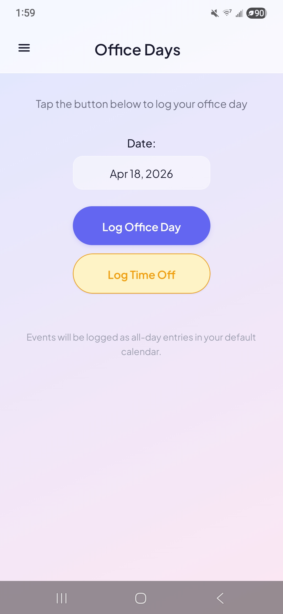
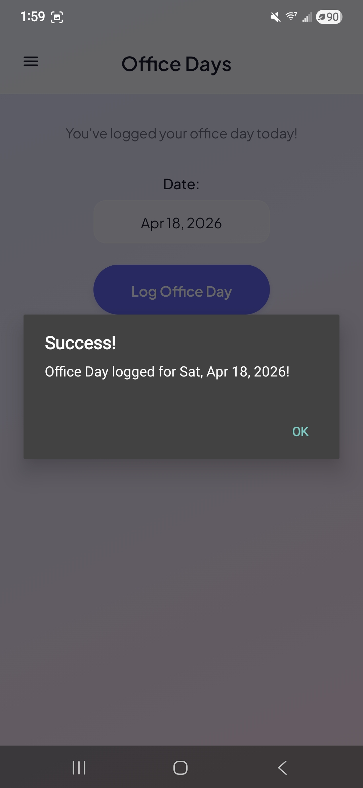
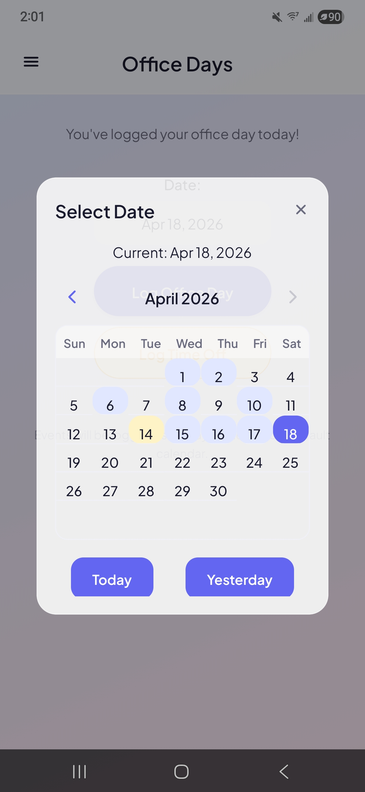
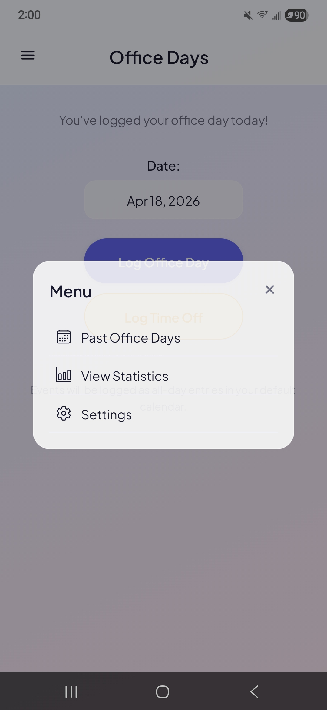
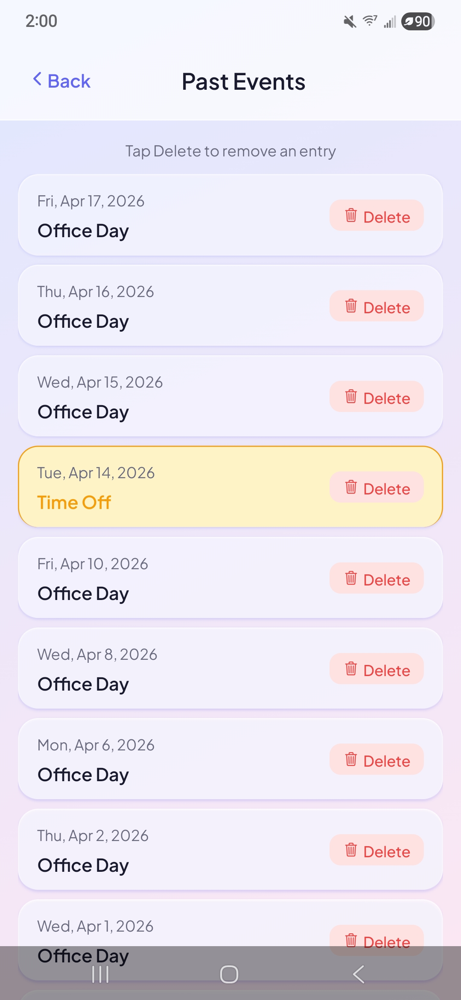
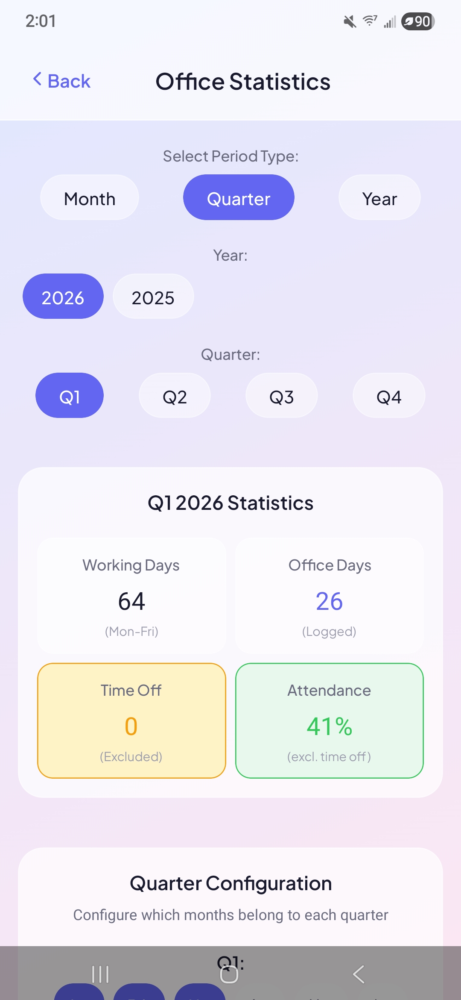
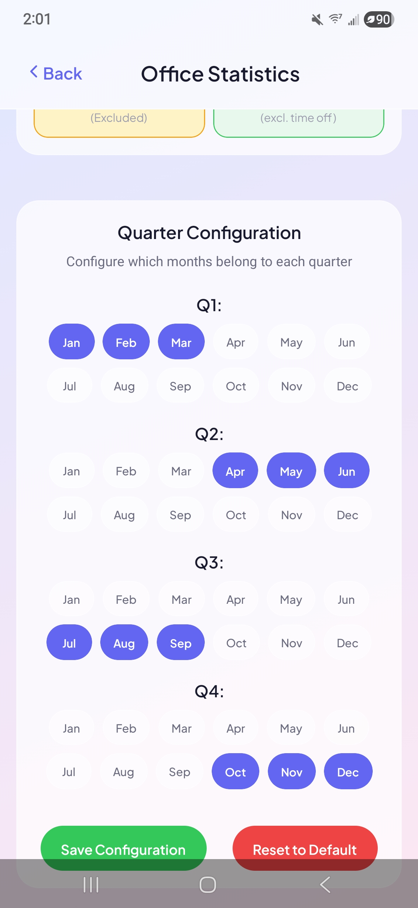
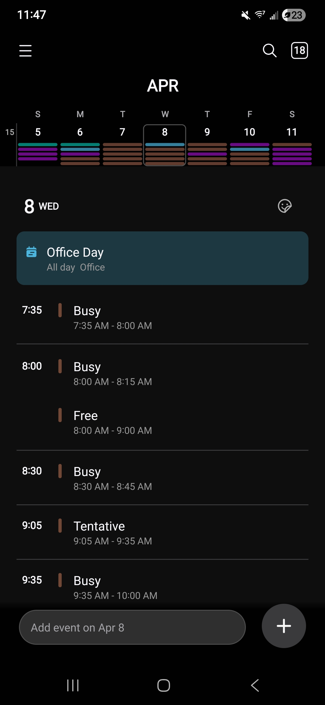

# Screenshots

## Main Screen

The main interface with date selector, "Log Office Day" and "Log Time Off" buttons. Events are logged as all-day entries in the device's default calendar.

## Success Confirmation

Confirmation dialog after logging an office day.

## Date Picker

Calendar widget for selecting a date. Office days are highlighted in blue, time off in yellow. Includes "Today" and "Yesterday" quick-select buttons.

## Menu

Navigation menu with access to Past Office Days, View Statistics, and Settings.

## Past Events

Chronological list of logged office days and time off entries. Time off entries are highlighted in yellow. Each entry can be deleted individually.

## Statistics Dashboard

Period-based statistics with Month/Quarter/Year toggle, year and quarter selectors. Shows working days, office days, time off count, and attendance percentage (time off excluded from the denominator).

## Quarter Configuration

Configurable quarter definitions for businesses with non-standard fiscal years. Each quarter's months can be customized and saved.

## Calendar Integration

"Office Day" events appear as all-day entries in the device's native calendar app.
